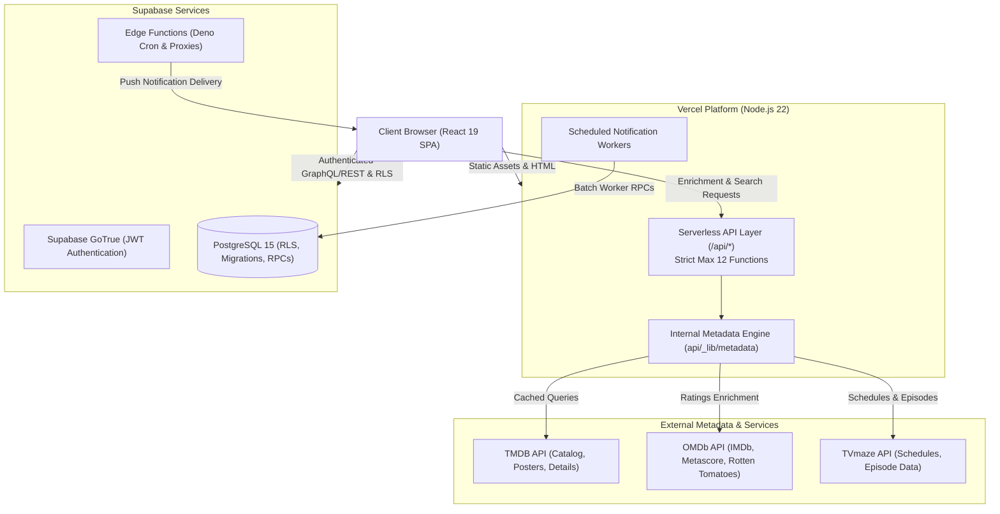

# CineTrekker

> A modern, cinematic movie and TV tracking web application designed for exploration, personal library management, and episode tracking.

[](https://github.com/MohamedJebahi21/cinetrekker/actions/workflows/release-quality.yml)
[](LICENSE)
[](.nvmrc)
[](https://cinetrekker.vercel.app)

---

## Live Demo

Experience the live application deployed on Vercel:  
👉 **[https://cinetrekker.vercel.app](https://cinetrekker.vercel.app)**

---

## Screenshots & Visuals

<!-- TODO: Add real application screenshots to docs/assets/ and update the paths below -->

| Desktop Home & Discovery | Mobile Layout & Navigation |
|:---:|:---:|
| <br>*(TODO: Replace with desktop hero & discovery screenshot)* | <br>*(TODO: Replace with mobile layout screenshot)* |

| Watchlist & Library Management | Rich Media & Episode Details |
|:---:|:---:|
| <br>*(TODO: Replace with watchlist view screenshot)* | <br>*(TODO: Replace with TV/Movie detail view screenshot)* |

---

## Features

Verified from source code routes (`src/AppRoutes.tsx`) and application components:

- **Cinematic Discovery & Spotlight**:
  - Hero carousel with active spotlight controls, backdrop trailers, and Up Next integration.
  - Multi-criteria discovery engine (`/discover`) filtering by genre, release year, runtime, and ratings.
  - Curated exploration routes: Decade Explorer (`/decades`), Award Winners (`/awards`), Genre Browser (`/genres`), and Trending (`/trending`).
- **Comprehensive Media Details**:
  - Unified detail views for movies and TV series (`/movie/:slug`, `/tv/:slug`) with synopsis, runtime, age certifications, and trailers.
  - TV Season Selector with episode list, broadcast dates, network information, and episode progress tracking.
  - Multi-provider ratings integration (TMDB score, IMDb rating, and Rotten Tomatoes via OMDb).
  - Cast & crew filmographies and individual person profiles (`/person/:id`).
- **Personal Library Management**:
  - Custom Watchlist (`/watchlist`) with sorting, filtering, priority badges, and quick-remove controls.
  - Watched History (`/watched`) with date-range filters, re-watch counter, and personal ratings.
  - Guest persistence mode: Local guest tracking without sign-in, seamlessly synchronizing upon account creation or login.
  - Printable Watchlist (`/watchlist/print`) for offline paper viewing.
- **Social & Community**:
  - Public member profiles (`/u/:username`) and private profile settings (`/profile`).
  - Follow TV series and actors (`/following`) with real-time new release notifications.
  - Centralized Notifications Center (`/notifications`) with grouped alerts and granular delivery preferences.
  - Community Member Directory (`/people`).
- **Gamification & Insights**:
  - CineQuest challenges (`/quests`) and achievement badges (`/achievements`).
  - Thematic media Collections (`/collections`).
  - Personalized Annual Recap (`/year-in-review`).
  - Episode Release Calendar (`/calendar`) tracking upcoming air dates.
  - Enhanced Statistics (`/stats`) with viewing breakdown charts by genre, era, and runtime.
- **Accessibility & Internationalization**:
  - Full internationalization support with 6 languages: English (`en`), French (`fr`), German (`de`), Spanish (`es`), Turkish (`tr`), and Arabic (`ar`).
  - Native Right-to-Left (RTL) layout switching for Arabic.
  - Dedicated Accessibility Settings (`/accessibility`) with high-contrast, font scaling, and reduced motion modes.
- **Trust, Privacy & Transparency**:
  - Dedicated Trust Center (`/trust`), Privacy Policy (`/privacy`), Terms (`/terms`), Cookie Policy (`/cookies`), and Service Status (`/status`).
  - Measurement Methodology page (`/measurement`) detailing privacy-preserving analytics.

---

## Tech Stack

| Layer | Technologies |
| :--- | :--- |
| **Frontend Framework** | [React 19](https://react.dev/) + [TypeScript 5](https://www.typescriptlang.org/) |
| **Build Tool & Bundler** | [Vite 8](https://vite.dev/) (with SWC plugin and Rollup/Rolldown asset optimization) |
| **Routing** | [React Router 7](https://reactrouter.com/) |
| **State & Data Fetching** | [TanStack Query v5](https://tanstack.com/query/latest) (React Query) |
| **UI Components & Styling** | [Tailwind CSS](https://tailwindcss.com/) + [Radix UI primitives](https://www.radix-ui.com/) + [Lucide Icons](https://lucide.dev/) |
| **Animations** | [Framer Motion](https://www.framer.com/motion/) |
| **Backend & Serverless** | [Vercel Serverless Functions](https://vercel.com/docs/functions) (Node.js 22 runtime) |
| **Database & Auth** | [Supabase](https://supabase.com/) (PostgreSQL 15+, GoTrue Auth, Row Level Security, RPCs) |
| **Metadata Providers** | [TMDB API](https://www.themoviedb.org/documentation/api), [OMDb API](https://www.omdbapi.com/), [TVmaze API](https://www.tvmaze.com/api) |
| **Testing & Quality** | Node.js Test Runner, [Playwright](https://playwright.dev/), [Lighthouse CI](https://github.com/GoogleChrome/lighthouse-ci), ESLint |

---

## Architecture Overview

CineTrekker follows a hybrid Single-Page Application (SPA) architecture backed by Vercel Serverless Functions and Supabase managed services:



### Serverless Function Constraint (Vercel Hobby Plan)
> [!IMPORTANT]
> The repository operates under the strict **12-function cap** imposed by Vercel's Hobby tier. All API logic is consolidated within 12 endpoints under `api/`. Shared business logic, provider adapters, rate-limiters, and helpers reside in `api/_lib/` rather than independent serverless routes.

---

## Getting Started

### Prerequisites

- **Node.js**: `22.x` (see [`.nvmrc`](.nvmrc))
- **npm**: `10.x` or higher
- A [Supabase](https://supabase.com/) project
- A [TMDB API](https://www.themoviedb.org/documentation/api) key (v3 auth)
- *(Optional)* An [OMDb API](https://www.omdbapi.com/) key

### 1. Clone the Repository

```bash
git clone https://github.com/MohamedJebahi21/cinetrekker.git
cd cinetrekker
```

### 2. Install Dependencies

Standardize on `npm`:

```bash
npm install
```

### 3. Configure Environment Variables

Copy the template to your local environment file:

```bash
cp .env.example .env.local
```

Configure your variables according to the table below:

| Variable | Required | Where to Obtain | Server-Only? | Description |
| :--- | :---: | :--- | :---: | :--- |
| `VITE_SUPABASE_URL` | **Yes** | Supabase Dashboard → Settings → API | No | Public Supabase project URL |
| `VITE_SUPABASE_ANON_KEY` | **Yes** | Supabase Dashboard → Settings → API | No | Public Supabase anonymous client key |
| `VITE_SUPABASE_PROJECT_ID` | **Yes** | Supabase Dashboard → Project Settings | No | Supabase unique project reference |
| `TMDB_API_KEY` | **Yes** | TMDB Settings → API (v3 key) | **Yes** | Serverless function access to TMDB |
| `OMDB_API_KEY` | No | [omdbapi.com/apikey.aspx](https://www.omdbapi.com/apikey.aspx) | **Yes** | External ratings enrichment |
| `OPENAI_API_KEY` | No | OpenAI Platform → API Keys | **Yes** | AI-driven recommendation generation |
| `SUPABASE_SERVICE_ROLE_KEY` | No | Supabase Dashboard → Settings → API | **Yes** | Admin/Cron operations (keep secret!) |
| `CRON_SECRET` | No | Random high-entropy token | **Yes** | Bearer secret protecting `/api/jobs/*` |
| `VITE_ENABLE_VERCEL_ANALYTICS` | No | Boolean flag (`true`/`false`) | No | Toggles Vercel Web Analytics |
| `VITE_ENABLE_VERCEL_SPEED_INSIGHTS` | No | Boolean flag (`true`/`false`) | No | Toggles Vercel Speed Insights |

### 4. Supabase Setup & Migrations

Apply database migrations to your Supabase project using the Supabase CLI or SQL Editor:

```bash
# Link your local project to your remote Supabase instance
npx supabase link --project-ref YOUR_PROJECT_ID

# Push all schema migrations
npx supabase db push
```

*Migrations reside in [`supabase/migrations/`](supabase/migrations/) and are idempotent.*

### 5. Run the Local Development Server

```bash
npm run dev
```

Open [http://localhost:5173](http://localhost:5173) in your browser.

### 6. Build for Production

```bash
npm run build
```

This compiles client assets into `dist/` and runs an automated bundle-budget gate check.

---

## Scripts & Quality Gates

| Command | Purpose |
| :--- | :--- |
| `npm run dev` | Starts Vite local development server with HMR |
| `npm run build` | Builds production bundle and executes asset budget validator |
| `npm run preview` | Starts local preview of production build |
| `npm run lint` | Runs ESLint across all TypeScript and JavaScript files |
| `npm run type-check` | Runs TypeScript compiler checks (`tsc --noEmit`) |
| `npm run test:ci` | Runs full static and security verification gate |
| `npm run test:security` | Runs API endpoint security and access control tests |
| `npm run test:privacy` | Verifies privacy consent gating and telemetry boundaries |
| `npm run test:professionalization` | Verifies UI and navigation contracts |
| `npm run test:unit` | Executes suite of unit tests for hooks, providers, and state |
| `npm run test:smoke` | Runs Playwright smoke tests against Chromium |
| `npm run test:e2e:desktop` | Runs Playwright functional matrix across Chromium, Firefox, and WebKit |
| `npm run i18n:verify` | Audits translation completeness across AR, DE, EN, ES, FR, TR |
| `npm run audit:desktop` | Runs local Lighthouse desktop performance audit |

---

## Testing

CineTrekker maintains strict automated test coverage across multiple dimensions:

- **Security & Authorization**: `npm run test:security` validates that serverless API endpoints reject forged requests, unauthorized cron invocations, and parameter tampering.
- **Privacy & Telemetry**: `npm run test:privacy` confirms that external analytics remain inert until explicit cookie consent is granted and no user identifiers or search queries leak.
- **End-to-End & Cross-Browser**: Playwright tests cover desktop (Chromium, Firefox, WebKit) and mobile (Pixel 7, iPhone 14) viewports. Run `npm run test:e2e:desktop`.
- **Localization Rigor**: `npm run i18n:verify` guarantees strict key parity between English and all supported language bundles.
- **Lighthouse Performance**: `npm run audit:desktop` runs Lighthouse audits locally to check Core Web Vitals, accessibility, and SEO.

---

## Deployment (Vercel)

CineTrekker is optimized for zero-configuration deployment on [Vercel](https://vercel.com):

1. Import the repository in the Vercel Dashboard.
2. Ensure the Framework Preset is set to **Vite**.
3. Set the Node.js version to **22.x** in Project Settings.
4. Add production environment variables (`TMDB_API_KEY`, `VITE_SUPABASE_URL`, `VITE_SUPABASE_ANON_KEY`, `VITE_SUPABASE_PROJECT_ID`, and optional keys).
5. Deploy. Security headers, caching rules, and rewrites are managed automatically via [`vercel.json`](vercel.json).

---

## Project Structure

```text
cinetrekker/
├── .github/                     # GitHub Actions CI workflows, issue & PR templates
│   ├── ISSUE_TEMPLATE/          # Bug report and feature request issue templates
│   ├── workflows/               # release-quality.yml and visual snapshot workflows
│   ├── PULL_REQUEST_TEMPLATE.md # PR checklist and invariant validation
│   └── dependabot.yml           # Automated weekly dependency updates
├── api/                         # Vercel Serverless Functions (Max 12 endpoints)
│   ├── _lib/                    # Private serverless helpers, rate limiting, and logger
│   │   └── metadata/            # Normalized multi-provider metadata layer
│   └── ...                      # Public API routes (/api/health, /api/enrichment, etc.)
├── docs/                        # Project documentation and engineering guides
│   ├── AI_RULES.md              # Core engineering directives and workflow rules
│   ├── ARCHITECTURE.md          # Runtime model, security layers, and data flows
│   ├── DEFINITION_OF_DONE.md    # Reusable quality and delivery checklist
│   ├── PROJECT_CONTEXT.md       # Current system state, route catalog, and schemas
│   ├── metadata-providers.md    # Guide to TMDB, OMDb, and TVmaze integration
│   ├── design-context.md        # Brand personality, aesthetics, and principles
│   └── issue-drafts.md          # Backlog items and security rotation checklist
├── public/                      # Static assets, icons, and robots.txt
├── src/                         # Client-side React 19 application
│   ├── components/              # Reusable UI components and layout elements
│   │   └── ui/                  # Radix UI primitives and design tokens
│   ├── contexts/                # React contexts (Auth, Theme, etc.)
│   ├── hooks/                   # Custom React hooks and TanStack queries
│   ├── lib/                     # Client utilities, sanitizers, and validation schemas
│   ├── locales/                 # i18n JSON bundles (en, fr, de, es, tr, ar)
│   ├── pages/                   # Application route views (35+ verified pages)
│   ├── services/                # Supabase and external API client adapters
│   └── types/                   # TypeScript interfaces and schemas
├── supabase/                    # Supabase database configuration
│   ├── functions/               # Deno Edge Functions
│   └── migrations/              # PostgreSQL schema migrations (idempotent SQL)
├── tests/                       # Test suites and test configurations
│   ├── config/                  # Lighthouse CI and test configuration files
│   └── ...                      # Node.js and Playwright test specs
├── AGENTS.md                    # Universal AI agent instructions entry point
├── CLAUDE.md                    # Instructions for Claude Code assistant
├── CODE_OF_CONDUCT.md           # Contributor Covenant v2.1
├── CONTRIBUTING.md               # Contribution workflow, branch conventions, and quality gates
├── LICENSE                      # MIT Open Source License
├── package.json                 # Project dependencies, scripts, and engines
└── vercel.json                  # Vercel deployment headers, routes, and security policies
```

---

## Roadmap

Planned improvements and community priorities:

- [ ] Complete external human screen-reader and assistive technology audit (WCAG 2.2 AAA).
- [ ] Add Watchmode streaming provider adapter into the normalized metadata layer.
- [ ] Add native offline caching for PWA reading mode.
- [ ] Expand social features with custom user lists sharing and collaborative watch parties.

---

## Contributing

Contributions are welcome! Please read our [Contributing Guidelines](CONTRIBUTING.md) and [Code of Conduct](CODE_OF_CONDUCT.md) before submitting pull requests.

---

## Security

Please report vulnerabilities responsibly. See [`SECURITY.md`](SECURITY.md) for our disclosure policy and contact methods.

---

## License

This project is licensed under the **MIT License** — see the [LICENSE](LICENSE) file for details.

---

## Credits & Attribution

- **TMDB**: This product uses the TMDB API but is not endorsed or certified by TMDB.  
  *(Note for developers: This mandatory attribution must also appear in the application UI on the footer and About page).*
- **OMDb API**: Film metadata, box office figures, and Rotten Tomatoes scores provided by [OMDb](https://www.omdbapi.com/).
- **TVmaze**: TV series schedules, episode guides, and network information powered by [TVmaze API](https://www.tvmaze.com/api).
- **Icons**: [Lucide Icons](https://lucide.dev/).
