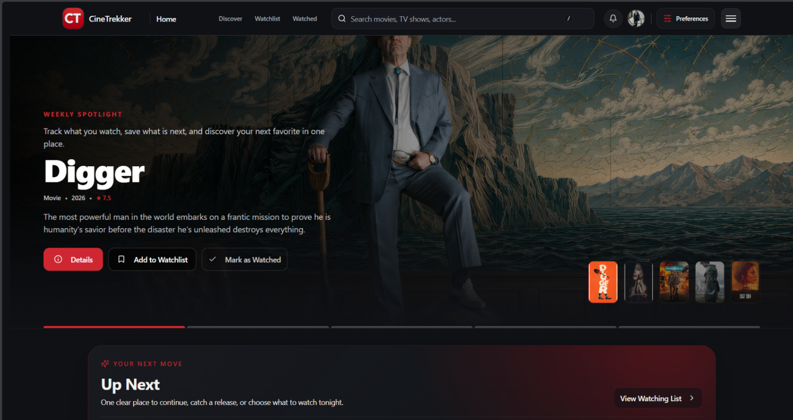
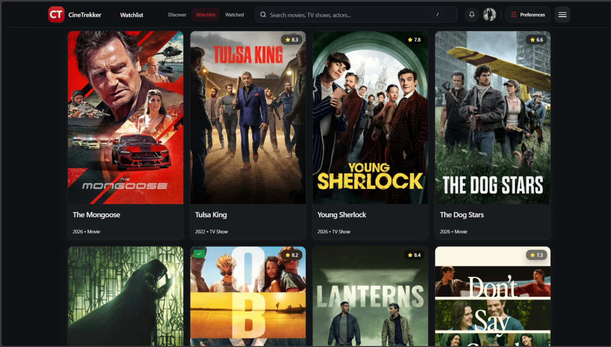
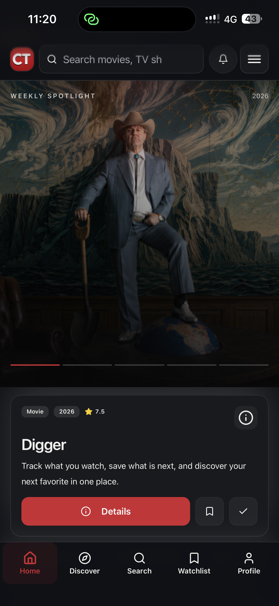
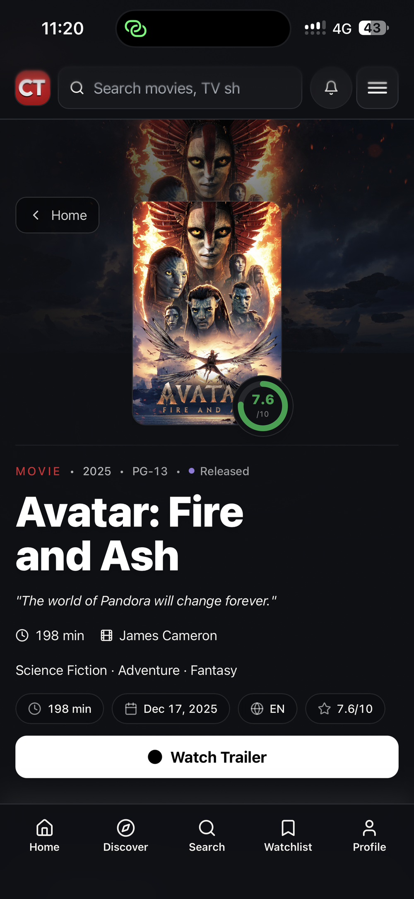

# CineTrekker

> A modern, cinematic movie and TV tracking web application designed for exploration, personal library management, and episode tracking.

[](https://github.com/MohamedJebahi21/cinetrekker/actions/workflows/release-quality.yml)
[](LICENSE)
[](.nvmrc)
[](https://cinetrekker.vercel.app)

---

## Live Demo

Experience the live application deployed on Vercel:  
👉 **[https://cinetrekker.vercel.app](https://cinetrekker.vercel.app)**

---

## Screenshots

<div align="center">

### Desktop Experience

| Desktop Home & Weekly Spotlight | Watchlist & Library Grid |
| :---: | :---: |
|  |  |
| *Hero discovery carousel with trailer previews & quick tracking* | *Visual poster grid with ratings, status tags & sorting* |

### Mobile Experience

| Mobile Home & Spotlight | Mobile Media Details & Actions |
| :---: | :---: |
|  |  |
| *Touch-first spotlight & bottom navigation* | *Release stats, score ring, trailer modal & quick-log* |

</div>

---

## Features

Verified from source code routes (`src/AppRoutes.tsx`) and application components:

- **Cinematic Discovery & Spotlight**:
  - Hero carousel with active weekly spotlight controls, backdrop previews, and quick actions.
  - Multi-criteria discovery engine (`/discover`) filtering by genre, release year, runtime, and minimum ratings.
  - Curated exploration routes: Trending (`/trending`), Upcoming Releases (`/upcoming`), Decades Explorer (`/decades`), Award Winners (`/awards`), and Genre Hub (`/genres`).
- **Comprehensive Media Details**:
  - Unified detail views for movies and TV series (`/movie/:slug`, `/tv/:slug`) with synopsis, runtime, certifications, and high-definition trailer playback.
  - TV Season Selector with episode breakdown, air dates, network information, and granular episode completion tracking.
  - Multi-provider ratings integration (TMDB community score, IMDb rating, and Rotten Tomatoes via OMDb).
  - Cast & crew filmographies and dedicated person profiles (`/person/:slug`).
- **Personal Library Management**:
  - Watchlist (`/watchlist`) with sorting (date added, rating, title), filtering (movie vs. TV), and priority badges.
  - Watched History (`/watched`, `/watch-history`) with date-range filters, re-watch counter, and personal ratings.
  - Continue Watching workflow with season-aware progress calculations, excluding Season 0 specials from primary completion metrics.
  - Dual persistence model: Fully functional guest tracking via browser storage with seamless database synchronization upon signing up or logging in.
  - Printable Watchlist (`/print-watchlist`) for offline reference.
- **Following & Notification Engine**:
  - Follow TV series and movies (`/following`) with release-date tracking.
  - Notification inbox (`/notifications`) alerting users when followed shows air new episodes or movies release.
  - Background cron worker (`/api/jobs/check-followed-updates`) running daily at 03:00 UTC with an execution deadline guard and cursor pagination.
- **Community & Social Insights**:
  - Member directory (`/people`) and public member profiles (`/user/:userId`) with customizable public/private visibility controls.
  - Personalized Annual Recap (`/year-in-review`) summarizing total hours watched, top genres, and milestone streaks.
  - Release Calendar (`/calendar`) mapping upcoming episodes and theatrical debuts across the month.
  - Analytics & Statistics (`/stats`, `/statistics`, `/enhanced-stats`) featuring Recharts breakdowns by genre distribution, release decade, and runtime.
- **Gamification & Engagement**:
  - CineQuest challenges (`/quests`) and achievement badges (`/achievements`) rewarding consistent cataloging.
  - Thematic media Collections (`/collections`, `/collections/:collectionId`).
- **Accessibility & Internationalization**:
  - Full internationalization across 6 languages: English (`en`), French (`fr`), German (`de`), Spanish (`es`), Turkish (`tr`), and Arabic (`ar`).
  - Native Right-to-Left (RTL) layout switching for Arabic.
  - Dedicated Accessibility Settings (`/accessibility`) supporting high-contrast mode, reduced motion, and OLED pure black theme.
- **Trust, Privacy & Governance**:
  - Comprehensive Trust Center (`/trust`), Privacy Policy (`/privacy`), Terms of Service (`/terms`), Cookie Policy (`/cookies`), and System Status (`/status`).
  - Privacy-preserving analytics mode honoring cookie consent preferences (`/measurement`).

---

## Tech Stack

| Layer | Technologies | Purpose in CineTrekker |
| :--- | :--- | :--- |
| **Frontend Framework** | [React 19](https://react.dev/) + [TypeScript 5](https://www.typescriptlang.org/) | Core client-side SPA rendering with strict types |
| **Build & Tooling** | [Vite 8](https://vite.dev/) (`@vitejs/plugin-react-swc`) | Lightning-fast HMR and optimized production bundling |
| **Routing** | [React Router 7](https://reactrouter.com/) (`react-router-dom`) | Client-side routing, route loaders, and redirect guards |
| **State & Data Fetching** | [TanStack Query v5](https://tanstack.com/query/latest) | Server-state caching, background revalidation, and optimistic updates |
| **UI Components & Icons** | [Tailwind CSS](https://tailwindcss.com/) + [Radix UI primitives](https://www.radix-ui.com/) + [Lucide React](https://lucide.dev/) | Accessible, composable UI components with dark-mode tokens |
| **Animations & Drawers** | [Framer Motion](https://www.framer.com/motion/) + [Vaul](https://vaul.emilkowal.ski/) | Fluid transitions, hero reveals, and mobile swipe drawers |
| **Charts & Data Viz** | [Recharts](https://recharts.org/) | Viewing distribution and genre analysis charts (isolated vendor chunk) |
| **Backend / Serverless** | [Vercel Serverless Functions](https://vercel.com/docs/functions) (Node.js 22 runtime) | 12-function consolidated API layer for proxies, jobs, and metadata |
| **Database & Auth** | [Supabase](https://supabase.com/) | PostgreSQL 15+, GoTrue JWT authentication, Row Level Security (RLS) |
| **Metadata Providers** | [TMDB API](https://www.themoviedb.org/documentation/api), [OMDb API](https://www.omdbapi.com/), [TVmaze API](https://www.tvmaze.com/api) | Multi-source catalog, ratings, schedules, and episode data |
| **Monitoring & Telemetry**| [Sentry](https://sentry.io/), Vercel Analytics, Speed Insights, Umami Analytics | Error tracking, Web Vitals monitoring, and privacy-conscious analytics |
| **Abuse & Bot Protection**| [Cloudflare Turnstile](https://www.cloudflare.com/products/turnstile/), Upstash Redis REST | Rate limiting on public endpoints and bot-safe feedback submissions |

---

## Architecture Overview

CineTrekker utilizes a decoupled Single-Page Application (SPA) architecture with an edge metadata rewrite engine and a consolidated serverless API layer:

```mermaid
flowchart TD
    Client["Client Browser (React 19 SPA)"]
    
    subgraph VercelEdge["Vercel Platform (Node.js 22 & Edge)"]
        EdgeMeta["Edge Metadata Engine (api/edge-meta.js)<br>Serves dynamic OpenGraph/Twitter tags for crawlers"]
        APILayer["Consolidated Serverless API (/api/*)<br>Strict Max 12 Endpoints"]
        CronJob["Scheduled Background Worker<br>(api/jobs/check-followed-updates.js)"]
    end
    
    subgraph ExternalServices["External Metadata & Abuse Prevention"]
        TMDB["TMDB API (Catalog, Images, Videos)"]
        OMDb["OMDb API (IMDb & Rotten Tomatoes)"]
        TVmaze["TVmaze API (Schedules & Episode Guides)"]
        Turnstile["Cloudflare Turnstile (Bot Verification)"]
        Upstash["Upstash Redis (Distributed Rate Limiting)"]
    end
    
    subgraph SupabaseCloud["Supabase Managed Cloud"]
        Auth["Supabase GoTrue (JWT Sessions)"]
        Postgres[("PostgreSQL 15 (RLS, Migrations, RPCs)")]
    end

    Client -->|Static Assets & Hydration| VercelEdge
    Client -->|Authenticated User Queries (RLS Protected)| Postgres
    Client -->|Auth State & Token Refresh| Auth
    Client -->|TMDB Proxy & Enrichment Requests| APILayer
    
    EdgeMeta -->|Injects Page Meta into dist/index.html| Client
    APILayer -->|Bot Validation| Turnstile
    APILayer -->|Sliding Window Quota Checks| Upstash
    APILayer -->|Cached Catalog Requests| TMDB
    APILayer -->|Ratings Lookup| OMDb
    APILayer -->|Schedule Sync| TVmaze
    
    CronJob -->|Service-Role Scoped Episode Sync| Postgres
```

### Serverless Function Architecture (Vercel 12-Function Cap)
The serverless layer is strictly engineered within the 12-function cap imposed by Vercel's Hobby tier. Shared helpers, provider adapters, rate-limiting algorithms, and database clients live in `api/_lib/` rather than individual routes:

| Endpoint | Method | Authentication | External Services | Purpose |
| :--- | :---: | :---: | :---: | :--- |
| `/api/tmdb-proxy` | `GET` | Optional (Guest safe) | TMDB API | Proxies TMDB requests with server-side caching & token isolation |
| `/api/enrichment` | `GET` | None | OMDb, TVmaze | Fetches external ratings (IMDb, Metacritic) and TV broadcast schedules |
| `/api/recommend` | `POST` | Optional / User | TMDB, OpenAI | Generates personalized recommendations based on user library |
| `/api/follow` | `POST`, `DELETE` | Authenticated (JWT) | Supabase | Manages user follows for shows and movies |
| `/api/user/followed` | `GET` | Authenticated (JWT) | Supabase | Retrieves followed media with release and broadcast status |
| `/api/notifications` | `GET`, `PATCH` | Authenticated (JWT) | Supabase | Inbox retrieval, read acknowledgments, and notification archiving |
| `/api/feedback` | `POST` | Turnstile Verified | Resend, Supabase | User feedback and bug report submissions with bot defense |
| `/api/client-errors` | `POST` | None | Sentry / Supabase | Ingests unhandled client-side runtime errors for observability |
| `/api/edge-meta` | `GET` | None | TMDB API | Dynamic OpenGraph/Twitter/SEO metadata injection for crawlers |
| `/api/sitemap` | `GET` | None | TMDB API | Dynamic sitemap generator providing indexed media and static routes |
| `/api/health` | `GET` | None | Supabase, TMDB | System diagnostic endpoint reporting service and database readiness |
| `/api/jobs/check-followed-updates` | `GET` | Bearer (`CRON_SECRET`) | Supabase, TVmaze | Daily cron worker checking new episode releases for followed titles |

---

## Database Architecture

CineTrekker's PostgreSQL schema is fully managed through declarative migrations in `supabase/migrations/` and protected by **Row Level Security (RLS)**:

- **`profiles`**: User identity, avatar URL, display name, language preferences, and profile visibility (`public` vs. `private`).
- **`user_watchlist`**: Watchlist records with unique constraint on `(user_id, media_id, media_type)`, priority rankings, and notes.
- **`user_watched`**: Watched film and television entries with personal review scores and re-watch counts.
- **`watched_episodes`**: Granular per-episode watch history for television seasons.
- **`followed_shows` & `movie_followers`**: Tracking records connecting user accounts to specific titles for release alerts.
- **`notifications` & `notification_preferences`**: In-app alerts for newly released episodes and movies with channel delivery settings.
- **`collections` & `collection_items`**: User-curated thematic lists with media associations.
- **`push_subscriptions`**: Web push tokens for browser notifications.
- **`notification_worker_state`**: Cursor tracking state for the background notification job.

---

## Getting Started

### Prerequisites

- **Node.js**: `22.x` (see [`.nvmrc`](.nvmrc))
- **npm**: `10.x` or higher
- A [Supabase](https://supabase.com/) project
- A [TMDB API](https://www.themoviedb.org/documentation/api) key (v3 auth)
- *(Optional)* An [OMDb API](https://www.omdbapi.com/) key

### 1. Clone the Repository

```bash
git clone https://github.com/MohamedJebahi21/cinetrekker.git
cd cinetrekker
```

### 2. Install Dependencies

```bash
npm install
```

### 3. Configure Environment Variables

Create your local environment file:

```bash
cp .env.example .env.local
```

Populate the required credentials according to the specification below.

### 4. Apply Database Migrations

Push the idempotent SQL migrations to your Supabase project:

```bash
# Link local CLI to your Supabase project
npx supabase link --project-ref YOUR_PROJECT_ID

# Push all migrations
npx supabase db push
```

### 5. Run the Local Development Server

```bash
npm run dev
```

Visit [http://localhost:5173](http://localhost:5173) in your browser.

### 6. Build for Production

```bash
npm run build
```

The build compiles assets into `dist/` and runs a bundle-budget gate check.

---

## Environment Variables

| Variable | Scope | Required | Description |
| :--- | :---: | :---: | :--- |
| `VITE_SUPABASE_URL` | Client | **Yes** | Public Supabase project URL |
| `VITE_SUPABASE_ANON_KEY` | Client | **Yes** | Public Supabase anonymous client API key |
| `VITE_SUPABASE_PROJECT_ID` | Client | **Yes** | Unique reference ID for the Supabase project |
| `TMDB_API_KEY` | Server | **Yes** | Serverless function access key for TMDB v3 API |
| `OMDB_API_KEY` | Server | Optional | API key for IMDb and Rotten Tomatoes ratings enrichment |
| `OPENAI_API_KEY` | Server | Optional | API key for AI-driven recommendation queries (`/api/recommend`) |
| `SUPABASE_SERVICE_ROLE_KEY` | Server | Optional | Admin key for background cron jobs and worker state (keep secret) |
| `CRON_SECRET` | Server | Optional | Bearer authentication secret protecting `/api/jobs/*` endpoints |
| `UPSTASH_REDIS_REST_URL` | Server | Optional | Upstash Redis URL for distributed sliding-window rate limiting |
| `UPSTASH_REDIS_REST_TOKEN` | Server | Optional | Upstash Redis REST access token |
| `TURNSTILE_SECRET_KEY` | Server | Optional | Cloudflare Turnstile secret key for server-side captcha verification |
| `VITE_TURNSTILE_SITE_KEY` | Client | Optional | Public Cloudflare Turnstile widget site key |
| `VITE_SENTRY_DSN` | Client | Optional | Sentry DSN for client-side crash and error reporting |
| `VITE_UMAMI_WEBSITE_ID` | Client | Optional | Website identifier for privacy-preserving Umami telemetry |
| `VITE_UMAMI_SCRIPT_URL` | Client | Optional | Script URL for hosted Umami analytics instance |
| `VITE_ENABLE_VERCEL_ANALYTICS` | Client | Optional | Toggles Vercel Web Analytics (`true`/`false`) |
| `VITE_ENABLE_VERCEL_SPEED_INSIGHTS` | Client | Optional | Toggles Vercel Speed Insights (`true`/`false`) |

---

## Available NPM Scripts

| Command | Description |
| :--- | :--- |
| `npm run dev` | Starts Vite local development server with Hot Module Replacement (HMR) |
| `npm run build` | Compiles production bundle and executes asset-budget verification |
| `npm run preview` | Starts a local HTTP server serving the compiled `dist/` directory |
| `npm run lint` | Runs ESLint across all TypeScript, TSX, and JavaScript source files |
| `npm run type-check` | Executes TypeScript type checking via `tsc --noEmit` |
| `npm run test` | Runs the automated CI gate (`test:ci`) followed by smoke tests (`test:smoke`) |
| `npm run test:ci` | Runs lint, type-check, security tests, privacy tests, and i18n verification |
| `npm run test:unit` | Executes Node.js native unit test runner across 115+ test suites |
| `npm run test:security` | Validates API endpoint authorization, parameter sanitization, and cron auth |
| `npm run test:privacy` | Verifies telemetry gating and cookie consent compliance |
| `npm run test:professionalization` | Verifies UI and navigation contracts |
| `npm run test:smoke` | Runs Playwright browser smoke tests against Chromium |
| `npm run test:e2e:desktop` | Runs Playwright end-to-end tests across Chromium, Firefox, and WebKit |
| `npm run i18n:verify` | Verifies translation key parity across all 6 supported locales |
| `npm run audit:desktop` | Runs a local Lighthouse performance and accessibility audit |

---

## Project Structure

```text
cinetrekker/
├── .github/                     # GitHub Actions CI workflows and issue templates
│   └── workflows/               # release-quality.yml release gate workflow
├── api/                         # Vercel Serverless Functions (Consolidated 12 endpoints)
│   ├── _lib/                    # Private serverless helpers, rate limiting, and normalizers
│   │   └── metadata/            # Multi-provider catalog adapters (TMDB, OMDb, TVmaze)
│   ├── jobs/                    # Scheduled background workers (check-followed-updates)
│   └── ...                      # Public API routes (/api/tmdb-proxy, /api/enrichment, etc.)
├── docs/                        # Project documentation and engineering guides
│   ├── assets/                  # Application screenshots and visuals
│   ├── AI_RULES.md              # Core engineering directives and workflow rules
│   ├── ARCHITECTURE.md          # Runtime model, security layers, and data flows
│   ├── DEFINITION_OF_DONE.md    # Delivery standards and quality gate checklist
│   └── SECURITY.md              # Security policies and vulnerability reporting procedures
├── public/                      # Static assets, webmanifest, favicons, and robots.txt
├── src/                         # Client-side React 19 application
│   ├── components/              # Composable UI components (details, home, layout, ui)
│   ├── contexts/                # React context providers (Auth, Theme, Lists)
│   ├── hooks/                   # Custom React hooks and TanStack Query wrappers
│   ├── lib/                     # Validation schemas, sanitizers, and progress calculations
│   ├── locales/                 # i18n JSON translation bundles (en, fr, de, es, tr, ar)
│   ├── pages/                   # Application route views (35+ verified pages)
│   ├── services/                # Supabase client and API service wrappers
│   └── types/                   # TypeScript interfaces, database schemas, and contracts
├── supabase/                    # Supabase database configuration
│   ├── functions/               # Deno Edge Functions
│   └── migrations/              # Idempotent PostgreSQL schema migrations
├── tests/                       # Unit tests, integration tests, and Playwright specifications
├── package.json                 # Project dependencies, scripts, and engine specifications
├── tsconfig.json                # TypeScript compiler configuration (client-scoped)
├── vercel.json                  # Vercel deployment headers, security policies, and cron rules
└── vite.config.ts               # Vite build configuration with custom chunk splitting
```

---

## Security & Reliability Mechanisms

- **Strict Content Security Policy (CSP)**: Built into `vercel.json` and edge responses, featuring Trusted Types (`require-trusted-types-for 'script'`), strict origin isolation (`COOP: same-origin`, `CORP: same-origin`), frame-ancestors restrictions, and disallowed inline script execution.
- **Row Level Security (RLS)**: Every user table in Supabase enforces strict owner-scoped RLS policies. Authenticated users can only read and write their own library, history, and notification data.
- **Edge Metadata & Crawler Fallbacks**: `api/edge-meta.js` intercepts crawler requests for `/movie/*` and `/tv/*`, dynamically injecting rich OpenGraph and Twitter cards directly into the HTML response before hydration.
- **Chunk Error Auto-Recovery**: `src/lib/chunkErrorRecovery.ts` catches stale asset hashes following new production deployments, smoothly handling cache revalidation without infinite reload loops.
- **Vendor Chunk Splitting**: Heavy libraries like Recharts and D3 are isolated into dedicated vendor chunks (`vendor-charts`), keeping initial bundle sizes well under performance budgets.

---

## Deployment (Vercel)

CineTrekker is optimized for deployment on [Vercel](https://vercel.com):

1. Connect the GitHub repository to Vercel.
2. Select the **Vite** framework preset.
3. Verify the Node.js version is set to **22.x** in Project Settings.
4. Add the required environment variables (`VITE_SUPABASE_URL`, `VITE_SUPABASE_ANON_KEY`, `VITE_SUPABASE_PROJECT_ID`, and `TMDB_API_KEY`).
5. Vercel automatically deploys pushes to `main`. Rewrites, security headers, and scheduled crons are managed automatically via [`vercel.json`](vercel.json).

---

## Contributing

Contributions are welcome! Please ensure all pull requests pass the release quality gates before requesting review:

```bash
npm run test:ci
```

---

## License

This project is licensed under the **MIT License** — see the [LICENSE](LICENSE) file for details.

---

## Credits & Attribution

- **TMDB**: This product uses the TMDB API but is not endorsed or certified by TMDB.  
  *(Mandatory attribution is maintained in the application UI, footer, and About page).*
- **OMDb API**: Movie metadata, box office figures, and Rotten Tomatoes scores provided by [OMDb](https://www.omdbapi.com/).
- **TVmaze**: TV series schedules, episode guides, and network information powered by [TVmaze API](https://www.tvmaze.com/api).
- **Icons**: [Lucide Icons](https://lucide.dev/).
